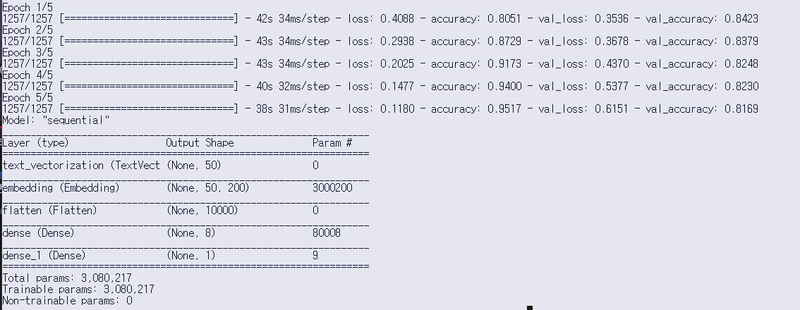
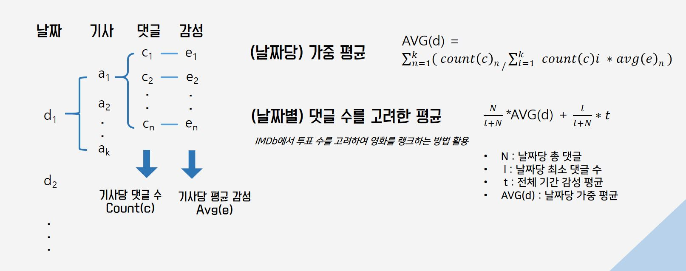
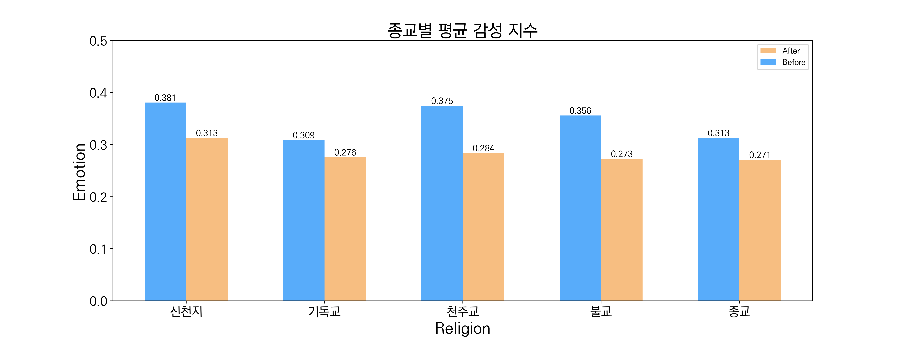
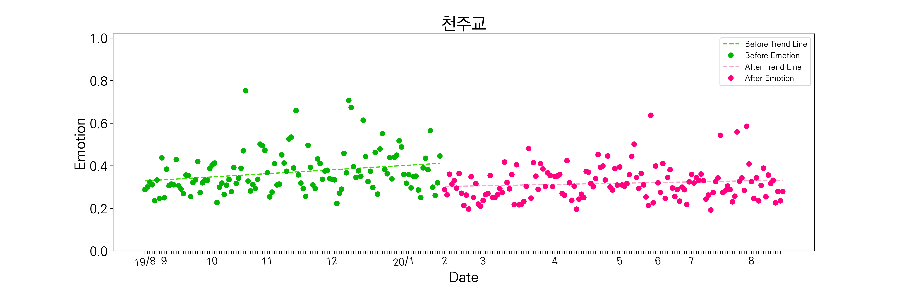
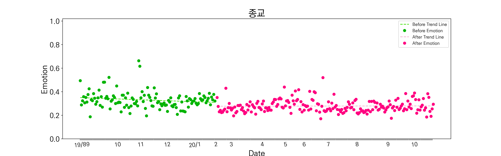
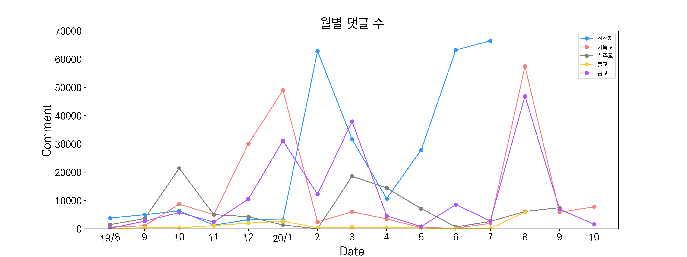
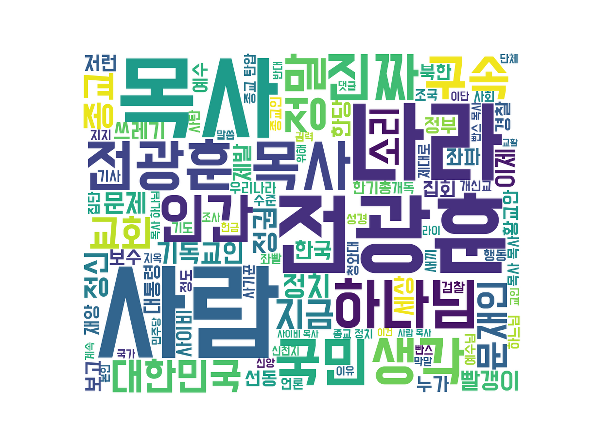
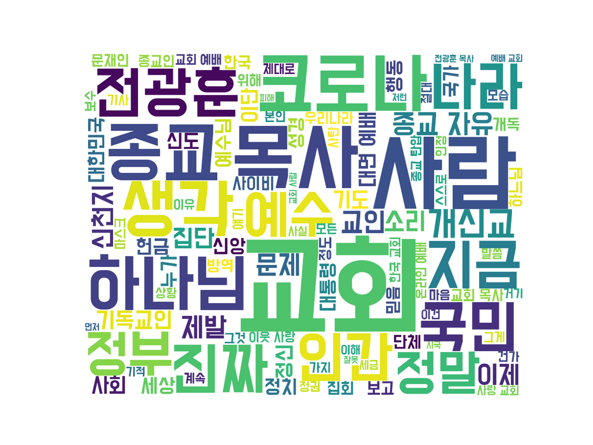
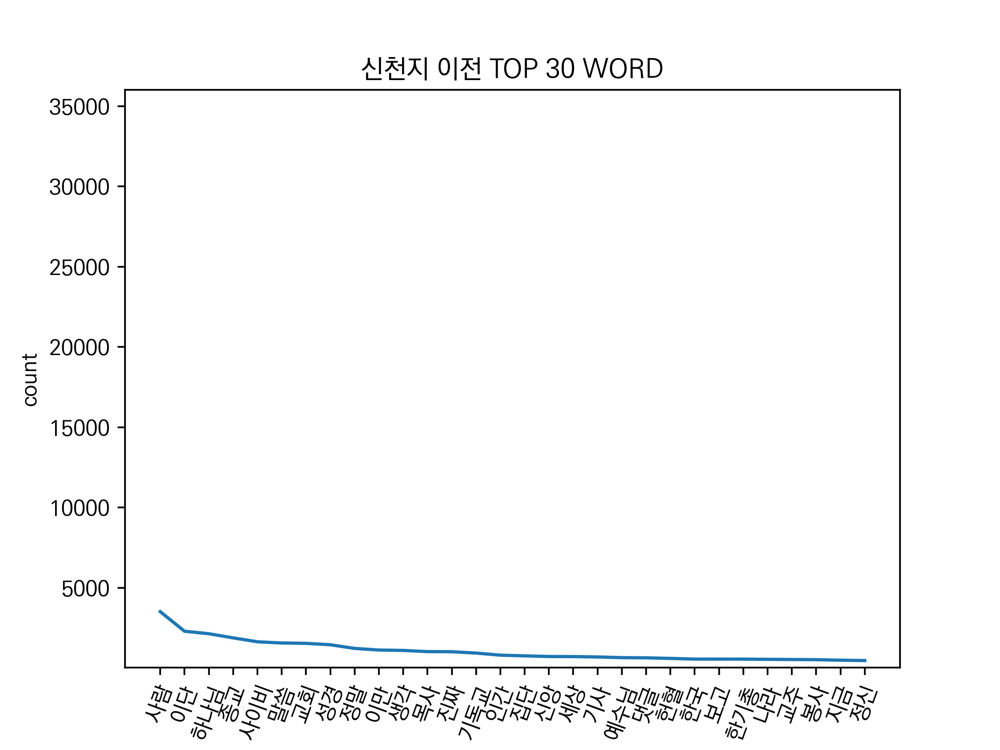
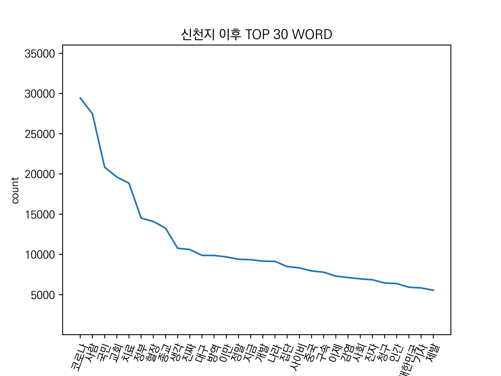

# Comment-Sentiment-Analysis
### Comment Sentiment Analysis using Deep Learning


📌 Author : [Minku Koo](https://github.com/Minku-Koo)    

📌 Project Period : Dec/2020 ~ Jan/2021    

📌 Contact : corleone@kakao.com    

📌 Main Library : tensorflow, keras, KoNLPy

📌 Keyword : "Sentiment Analysis", "Machine Learning", "Korean", "Deep Learning"    

## 📃 Table of Contents
- [Introduction](#comment-sentiment-analysis-using-deep-learning)
- [Data Scrapping](#1-scrapping-comment-data)
- [Data Labeling](#2-labeling-comment-data)
- [Data Preprocessing](#3-using-konlpy-okt)
- [Build Deep Learning Network](#4-build-deep-learning-network-using-keras)
- [Predict Data Sentiments](#5-predict-sentiments-value)
- [Result](#6-result-make-graph)


## 1. Scrapping Comment Data

- Python Crawler : ./python-code/comment_crawling.py
- Target Place : Naver, Daum News Comment
- Scrapped Data : Comment, Replay, Article Date (+ Title, Content)
- News Searching Keyword : "기독교", "불교", "천주교", "신천지", "종교"
- Data Saved Place : Database (MariaDB)
- Database Data to Text file - path : ./comment/raw-comment/

### 🔍 Scrapping Period per Religion 
|검색 키워드|수집 시작 기간|기준 날짜|수집 종료 기간|
|:--------:|:-----------:|:------:|:-----------:|
| 신천지 | 19.09.17 | 20.02.17 | 20.07.18 |
| 기독교 |19.08.20| 20.01.20 | 20.10.20 |
| 천주교 | 19.08.20 | 20.01.20 | 20.08.20 |
| 불교 | 19.08.20 | 20.01.20 | 20.08.20 |
| 종교 | 19.08.20 | 20.01.20 | 20.10.10 |

### 🔍 Scrapped Data Result

<table>
    <thead>
        <tr>
        <th rowspan="2">검색 키워드</th>
        <th colspan="2">이전 기간</th>
        <th colspan="2">이후 기간</th>
        </tr>
        <tr>
        <th>Article</th>
        <th>Comment</th>
        <th>Article</th>
        <th>Comment</th>
        </tr>
    </thead>
    <tbody>
        <tr>
            <td>신천지</td>
            <td>211</td>
            <td>22,658</td>
            <td>2,974</td>
            <td>262,840</td>
        </tr>
        <tr>
            <td>기독교</td>
            <td>1,771</td>
            <td>94,405</td>
            <td>1,186</td>
            <td>85,443</td>
        </tr>
        <tr>
            <td>천주교</td>
            <td>1,899</td>
            <td>37,010</td>
            <td>1,685</td>
            <td>56,881</td>
        </tr>
        <tr>
            <td>불교</td>
            <td>833</td>
            <td>6,465</td>
            <td>420</td>
            <td>7,585</td>
        </tr>
        <tr>
            <td>종교</td>
            <td>1,939</td>
            <td>52,527</td>
            <td>2,373</td>
            <td>122,206</td>
        </tr>
    </tbody>
</table>

## 2. Labeling Comment Data

- path : ./train-data/
- Comment Human Inspection : ./train-data/comment-labeling.csv
- Naver Movie Review Data : naver-ratings.csv
- _( Data from [Here](https://github.com/e9t/nsmc) )_

## 3. Using KoNLPy Okt

#### Text Data Preprocessing
```
okt.pos(comment)
remove 'Josa', 'Punctuation', 'Number'
save path : ./comment/after-okt-comment/
```


## 4. Build Deep Learning Network using Keras

- Python File Name : ./python-code/make_rnn_model.py
- Train Data path : ./train-data/
- Crawled Comment + Naver Movie Reivew => Transfer Learning
- Comment text data convert to Vector (using TextVectorization)
- Accuracy : 0.95
- Val Accuracy : 0.83



## 5. Predict Sentiments Value

1) Make json file -> dict[date][article] = [[comment list],[]]
1) Every Comment Labeling using Deep Learning Model
1) Update json file / dict[date][article] = [[comment list],[sentiment value list]] (path: ./comment/json-okt-comment)
1) Calculate sentiment value per date 
    + each Article sentiment : Weight Average _(article comment count / date comment count)_
    + each Date sentiment : using [IMDb's rating system](https://www.quora.com/How-does-IMDbs-rating-system-work)
    

## 6. RESULT (Make Graph)

### 📍 Average, Standard Deviation / Religion ###
<table>
    <thead>
        <tr>
        <th rowspan="2">검색 키워드</th>
        <th colspan="2">이전 기간</th>
        <th colspan="2">이후 기간</th>
        </tr>
        <tr>
        <th>평균</th>
        <th>표준 편차</th>
        <th>평균</th>
        <th>표준 편차</th>
        </tr>
    </thead>
    <tbody>
        <tr>
            <td>신천지</td>
            <td>0.381</td>
            <td>0.412</td>
            <td>0.313</td>
            <td>0.388</td>
        </tr>
        <tr>
            <td>기독교</td>
            <td>0.310</td>
            <td>0.372</td>
            <td>0.276</td>
            <td>0.371</td>
        </tr>
        <tr>
            <td>천주교</td>
            <td>0.375</td>
            <td>0.405</td>
            <td>0.284</td>
            <td>0.377</td>
        </tr>
        <tr>
            <td>불교</td>
            <td>0.356</td>
            <td>0.392</td>
            <td>0.272</td>
            <td>0.369</td>
        </tr>
        <tr>
            <td>종교</td>
            <td>0.313</td>
            <td>0.376</td>
            <td>0.271</td>
            <td>0.367</td>
        </tr>
    </tbody>
</table>


### 📍 Sentiment Average stick graph / Religion   ###
*(path : ./result-graph/emotion-average-stick/)*


### 📍 Sentiment time flow graph  ###
*(path : ./result-graph/emotion-flow/)*


   - Before COVID19 : green
   - After COVID19 : red
   - y axis
       + close to 1 : Positive
       + close to 0 : Negative
    <br><br>
   ✔ **천주교**    
         
   ✔ **종교**    
         
   
### 📍 All Comment Count per Month / Religion   ###
*(path : ./result-graph/comment-count/)*



### 📍 WordCloud / Religion  ###
*(path : ./result-graph/word-cloud/)*


   ✔ Before COVID19, 기독교      
           
   ✔ After COVID19, 기독교     
          

### 📍 Top 30 Word / Religion  ###
*(path : ./result-graph/word-cloud/)*


   ✔ Before COVID19, 신천지    
         
   ✔ After COVID19, 신천지    
         
    


